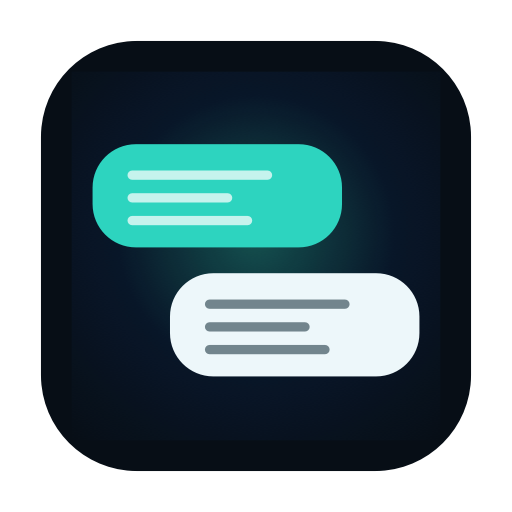
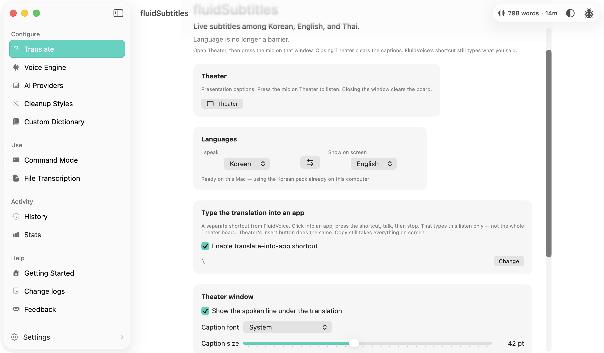
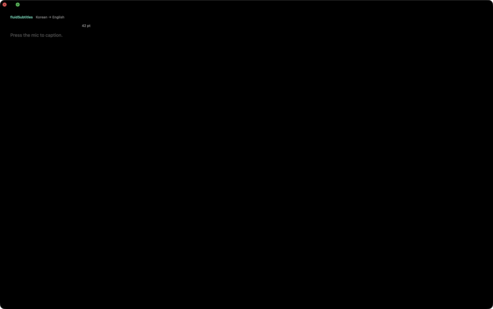

# fluidSubtitles

<p align="center">
  
</p>

**Connecting the world one caption at a time. Language is no longer a barrier.**

fluidSubtitles is a live translation and captioning app for macOS. It works among **Korean, English, and Thai** in either direction. Speak one of those languages. See the other on screen, or type it into the app you are using.



Open **Translate**, pick Korean, English, or Thai on each side, then press **Theater**. Listening lives on that window. Closing Theater clears the captions. The dictation shortcut still types what you said. A separate shortcut types this listen’s translation into another app. Translation uses Apple’s on-device Translation framework.



**fluidSubtitles is by [Chris Swim Lee](https://chrisswimlee.com), a branch of [FluidVoice](https://github.com/altic-dev/FluidVoice) by altic-dev.** Speech recognition, live engines, and the core macOS app are theirs. This branch adds live translation and Theater captions. Licensed under GPLv3 — please star and support the original project.

---

## Theater captions

1. Download a Voice Engine (Apple Speech is enough to try).
2. Open **Translate** and pick the language you speak and the language to show.
3. Press **Theater**, then **Listen**.
4. Closing Theater clears the board. **Insert** types this listen into the frontmost app. **Copy** takes everything on screen.

Accessibility permission is only required if you want a translation typed into other apps. Theater captions on your screen do not need it.

---

## Features

- **Korean, English, and Thai** — any pair, either direction
- **Theater captions** — a floating window you turn on, edit, and close
- **Translate into an app** — a separate shortcut from dictation; types the other language into the app you clicked
- **On-device translation** — Apple Translation language packs, processed locally
- **Multiple speech models** — Nemotron, Parakeet, Cohere, Apple Speech, and Whisper
- **Local-first** — voice and text stay on your Mac unless you opt in to a cloud AI provider
- **Menu bar access** — start, stop, and open settings from the menu bar

---

## Supported Models

| Model | Best for | Language support | Download size | Hardware |
| --- | --- | --- | --- | --- |
| Nemotron Speech 3.5 — Ultra Fast Low Latency | Streaming-capable multilingual dictation | ~40 languages | ~670 MB | Apple Silicon |
| Nemotron 3.5 Multilingual | Higher-accuracy multilingual dictation | ~40 languages | ~530 MB | Apple Silicon |
| [Parakeet Flash (Beta)](https://huggingface.co/nvidia/parakeet_realtime_eou_120m-v1) | Lowest-latency live English dictation | English | ~250 MB | Apple Silicon |
| Parakeet TDT v3 | Fast default multilingual dictation | [25 languages](#parakeet-tdt-v3-languages) | ~500 MB | Apple Silicon |
| Parakeet TDT v2 | Fastest English-only dictation | [English](#parakeet-tdt-v2-languages) | ~500 MB | Apple Silicon |
| Cohere Transcribe | High-accuracy multilingual dictation | [14 languages](#cohere-transcribe-languages) | ~1.4 GB | Apple Silicon |
| Apple Speech | Zero-download native macOS speech | [System languages](#apple-speech-languages) | Built-in | Apple Silicon + Intel |
| Whisper Tiny / Base / Small / Medium / Large | Broad compatibility, including Intel Macs | [99 languages](#whisper-language-support) | ~75 MB to ~2.9 GB | Apple Silicon + Intel |

### Parakeet TDT v3 Languages

Bulgarian, Croatian, Czech, Danish, Dutch, English, Estonian, Finnish, French, German, Greek, Hungarian, Italian, Latvian, Lithuanian, Maltese, Polish, Portuguese, Romanian, Russian, Slovak, Slovenian, Spanish, Swedish, and Ukrainian.

### Parakeet TDT v2 Languages

English.

### Cohere Transcribe Languages

English, French, German, Italian, Spanish, Portuguese, Greek, Dutch, Polish, Mandarin, Japanese, Korean, Vietnamese, and Arabic.

### Apple Speech Languages

System language support depends on the macOS speech recognition languages available on your machine.

### Whisper Language Support

Whisper supports up to 99 languages, depending on the model size you choose.

---

## Requirements

- macOS 15.0 (Sequoia) or later
- Apple Silicon Mac for all models
- Intel Macs supported via Whisper models (from 1.5.1+)
- ~1 GB disk space for a voice model
- Microphone access
- Accessibility permissions if you want a translation typed into other apps

---

## Building from Source

```bash
open fluidSubtitles.xcodeproj
```

Build and run in Xcode. All dependencies are managed via Swift Package Manager and pinned in `Package.resolved`.

For local signing, copy the example xcconfig and set your Apple team ID (a free Personal Team is enough):

```bash
cp xcconfig/Local.xcconfig.example xcconfig/Local.xcconfig
```

Then run a signed Debug build:

```bash
./build.sh
```

The signed build is written to `DerivedData/Build/Products/Debug/fluidSubtitles Debug.app`.
Keep launching that product after each rebuild so macOS can preserve its Accessibility
authorization.

For CI or contributors who do not have a signing identity, use the unsigned fallback:

```bash
./build.sh unsigned
```

Unsigned builds are tied to a specific executable version and may require Accessibility
permission to be removed and granted again after rebuilding.

Architecture notes live in [docs/ARCHITECTURE.md](docs/ARCHITECTURE.md). Latency budgets for the live path are in [docs/LIVE_TRANSLATION_LATENCY.md](docs/LIVE_TRANSLATION_LATENCY.md).

---

## Contributing

See [CONTRIBUTING.md](CONTRIBUTING.md). Please read the [code of conduct](CODE_OF_CONDUCT.md) and [security policy](SECURITY.md) before opening an issue or pull request.

When a change belongs in the upstream dictation engine rather than translation or captions, consider contributing to [FluidVoice](https://github.com/altic-dev/FluidVoice) as well.

---

## Run Integration Tests

```bash
xcodebuild test -project fluidSubtitles.xcodeproj -scheme fluidSubtitles -destination 'platform=macOS'
```

CI uses unsigned builds:

```bash
xcodebuild test -project fluidSubtitles.xcodeproj -scheme fluidSubtitles -destination 'platform=macOS' CODE_SIGNING_REQUIRED=NO CODE_SIGNING_ALLOWED=NO
```

---

## Privacy

fluidSubtitles is **local-first**. Your voice, audio, and transcribed text never leave your machine unless you explicitly opt in to a cloud AI provider.

This release does not send analytics, feedback, or update checks to FluidVoice or to a third-party analytics host.

**Not collected:**

- Voice, raw audio, or transcribed text
- Selected text, prompts, or AI responses
- Terminal commands, window titles, file paths, clipboard, or typed content

---

## License

From 2026-02-23 onward, this project is licensed under the [GNU General Public License, Version 3.0 (GPLv3)](LICENSE).

Versions published before this date were licensed under Apache License 2.0.

Third-party notices for models, frameworks, and logos are in [NOTICE](NOTICE).
