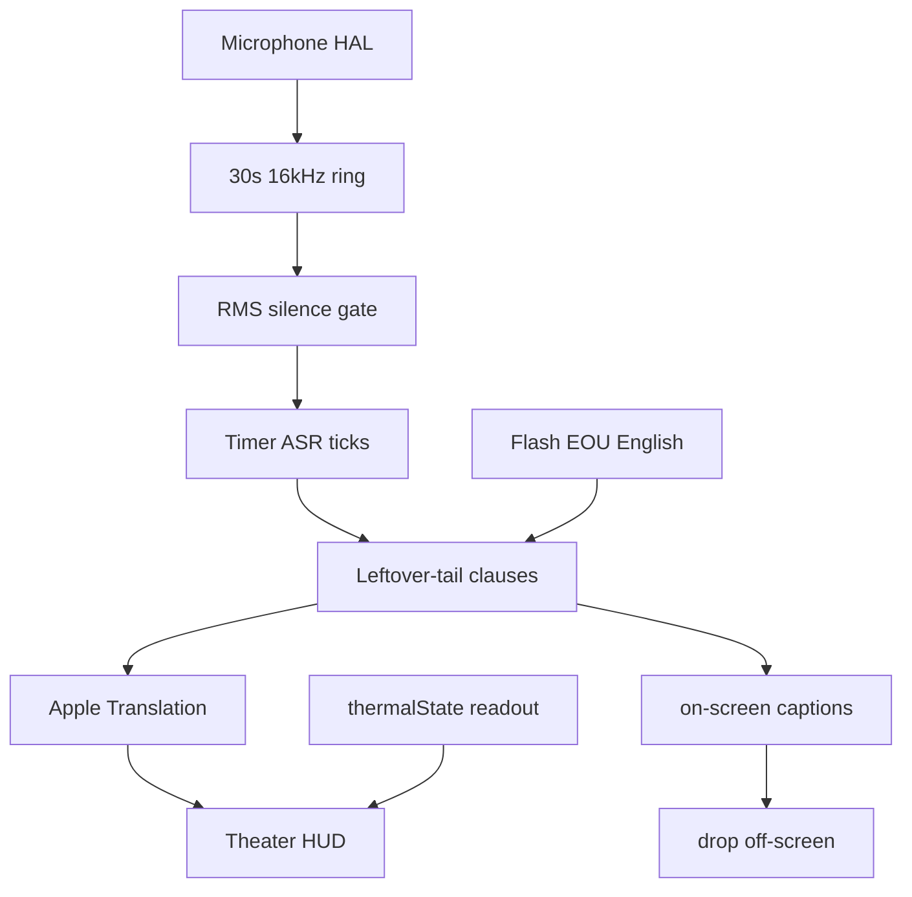

# Optimizing Local Streaming Translation on Apple Silicon: Speech Edges, Context Windows, and CoreAudio Latency

fluidSubtitles is a local Theater caption app for Korean, English, Thai, and Japanese. Theater runs on macOS 15 and later. Apple Speech Analyzer stays macOS 26+. Speech recognition and the macOS shell come from [FluidVoice](https://github.com/altic-dev/FluidVoice). fluidSubtitles adds clause-level Apple Translation, a measured latency clock, and a bounded 3-hour caption budget.

This note is the systems story, not a pitch. Numbers in the Theater HUD are measured. Numbers in tables below are budgets until you fill them from a recording.

## Pipeline

1. Direct Core Audio captures one microphone input stream. Packets carry `inputHostTime`. Multi-channel float or int16 buffers are downmixed to mono. Pause drops packets before `handle` and resets the sample-time anchor on resume so a hole does not look like silence. Then the same 16 kHz pipeline. Leftover Watch / `SCStream` app-audio capture is not the product path and is not part of first-hour Theater.
2. PCM is resampled to 16 kHz and kept in a 30-second ring. Hours of audio are not retained.
3. ASR ticks on a timer (Parakeet Flash: 200 ms). The first tick is not gated. After 400 ms of RMS silence, later ticks are skipped.
4. The growing transcript is split into finished clauses plus an open tail. Already-committed prefixes are stripped so the whole talk is not re-translated. During Theater, the live stitch is capped to the newest ~2,400 characters so a long listen cannot feed hours of text into every tick. Dictation Stop still stitches the full listen.
5. The current spoken clause can print while you talk. Apple Translation runs when a clause commits, then the Show-as title types out. Same-language pairs print the spoken sentence without a pack.
6. The live caption grows while you talk. A finished sentence that already has more speech after it commits mid-talk. End-of-utterance or RMS silence (~400 ms) commits leftover speech. Stop flushes remaining leftover. The Pause button does not flush. A twelve-word lineCut splits leftover only at that hard commit. Thin starters like “It.” do not print. Korean/Japanese/Thai 30-second confirm runs on Stop and silence leftover only. A caption already on the board stays.

## Why first words are not VAD-gated

A neural VAD in front of first words adds “did speech start?” delay and another Neural Engine client next to ASR and Translation. That is the wrong default for a keynote.

What we do instead:

- **RMS hold** using the existing capture `silenceThreshold`. First tick is immediate. After 400 ms below threshold, skip ASR ticks and start a new e2e measurement on the next voiced packet.
- **English Flash EOU** is already computed by `StreamingEouAsrManager`. A rising edge is a breath. Theater holds 400 ms so the last ASR tick can land, then commits leftover speech that is a real clause. Thin leftovers stay open.
- **Partial correction** is a fuller re-decode of the retained 30-second window. It runs on Stop and once per pause after the RMS hold for leftover speech only. A caption already on the board stays. It does not run on every ASR tick.

Word-by-word Apple Translation stays out. The Neural Engine translates one finished clause at a time.

## Context windows

The live Apple path still has no prompt. On commit, Theater sends the last 4 source clauses from this Listen plus the new one, then peels the new caption. Those four live in a short sliding window; older clauses drop as new ones commit. A clause-boundary approximation may prefetch that same payload so the print is already warm. Pronoun and zero-subject Korean or Japanese can still drift. Do not describe this as a streaming context window on the Neural Engine.

## CoreAudio

Capture is a first-party HAL IO path (`DirectCoreAudioInput` + a C ring), not `AVAudioEngine` on the live path. `AVAudioEngine` remains as dead fallback because device changes could block or crash it.

Host time on every packet is the e2e clock. Theater needs microphone permission. Insert-into-another-app needs Accessibility. Those are separate.

Devices must expose **one** input stream. Virtual devices are allowed (liveness fails open; clamshell still accepts external/virtual). Multi-stream aggregates fail with a clear error.

The app is **not sandboxed**. Hardened Runtime is on. Language packs and voice weights are user-downloaded (Apple Translation packs, Hugging Face Core ML / GGUF). Nothing of substance is vendored in the zip. Theater does not install a Zoom virtual microphone.

## Memory for a 3-hour keynote

| Resource | Bound |
| --- | --- |
| Live PCM | 30 s @ 16 kHz float |
| Live Theater transcript | newest 2,400 characters |
| Theater SwiftUI board | 3 on-screen captions |
| Overflow | dropped |
| UserDefaults snapshot | visible window only |

Theater is a live subtitle board. Off-screen captions are dropped. Bilingual export is the visible board. SRT/VTT use commit times when every cue has a date; otherwise they fall back to 4-second slots.

## Quantization and weights

Voice engines (Parakeet, Nemotron, Cohere, Whisper) download at first use. Apple Translation downloads a language pack the first time a pair is used. Listen is gated until the pack reports `.installed`. Theater keeps the Voice Engine you picked, except on **critical** thermal: that Listen can fall back to Apple Speech without writing the setting, then restore the user engine on Stop. English-only Parakeet cannot hear Korean, Japanese, or Thai; Listen stays off until you switch engine. No API key is required for the live Theater path.

## Thermal

`thermalState` is shown on the HUD. On serious or critical thermal, Theater skips extra ASR ticks after the 400 ms silence hold. First words and voiced speech still run. Translation is not paused. Critical thermal may also swap this Listen to Apple Speech (session-only).

## 60-second demo shot list

Record raw. No deck.

1. Open Theater on Apple Silicon. Pair English → Korean, English → Thai, or English → Japanese.
2. Press Listen. No API key, no cloud indicator.
3. Speak a short clause. Show the HUD: `e2e · ASR · MT · thermal`.
4. Hide chrome. The compact `Nms` readout stays in the corner.
5. Pause, then speak again. The clock resets for the next clause.
6. Optional: fill the board, then confirm older captions disappear when they leave the screen.

Fill the HUD numbers from that recording into this note before you publish the repo.

## What this is not

- Not a general translator. Product languages are Korean, English, Thai, and Japanese.
- Not TestFlight or the Mac App Store. Distribution is a Developer ID zip on GitHub Releases. See the README.
- Not a claim that classic VAD, CoreAudio p99 jitter, or thermal throttling are solved.
