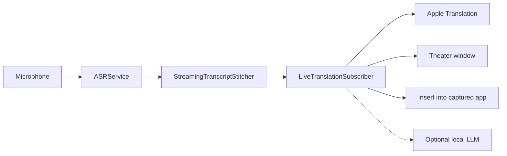

# Architecture

fluidSubtitles keeps FluidVoice for the Voice Engines only. Theater owns Listen, the partial bus, History, and the app identity. See [CREDITS.md](../CREDITS.md). This document is the map of **this product**: Theater captions and dictation insert among Korean, English, Thai, and Japanese.

## What to work on

| Area | Path | Role |
| --- | --- | --- |
| Live translation | `Sources/FluidSubtitles/Services/LiveTranslation/` | Clause split, Apple Translation, on-screen Theater captions, this-talk notes, pace cue, latency HUD, optional MLX. `LiveTranslationSubscriber` owns the session; `LiveTranslationCommitContext` and `LiveTranslationMT` are the commit / translate helpers; `TheaterStatus` is the status channel. |
| Theater UI | `Sources/FluidSubtitles/UI/LiveTranslation/` | Home, Theater window, presenter chrome, Setup Wizard |
| Speech engine | `ASRService.swift` plus `ASRService+*.swift` | Microphone → transcript. Reads `SpeechCapturePolicy`. Keep this as the engine, not the product. |
| Theater Listen | `ContentView+TheaterListen.swift`, `TheaterSpeechSession.swift` | Caption and insert start/stop. `prepareListen` pins I speak once, then `asr.start`. Never `ActiveRecordingMode.dictate`. |
| Dictation insert | `TypingService`, `GlobalHotkeyManager` | Listen and type uses the app captured at start. Type into app uses the frontmost field. Caption Listen is `HotkeyHoldModeType.captionListen`. |
| Overlay | `BottomOverlayView`, `NotchOverlayManager` | Insert chip only. Not the live caption bus. |
| Settings | `SettingsStore.swift` plus `SettingsStore+*.swift` | Persist models, shortcuts, Theater options. Sidebar uses `SettingsSection.productSections` (no Dictation). |
| App shell | `ContentView.swift` plus `ContentView+*.swift` | Window, Theater Listen, onboarding |

New settings belong in a `SettingsStore+*.swift` file, not in the core store. New ContentView routing belongs in `ContentView+*.swift`.

## Live path

1. Theater Listen, Voice, Translate, and I speak / Show as run on macOS 15 and later. Apple Speech Analyzer stays macOS 26+. `TheaterSpeechSession` installs the capture policy and sinks `$partialTranscription` into `LiveTranslationController.handlePartial`. `MenuBarManager` does not forward Theater partials. `ASRService` produces partial and final transcripts from the selected Voice Engine. Theater Listen keeps the custom dictionary and leaves spoken words such as "period" and "um" alone. It does not pause the presenter's media, play a start or stop chime, or switch Parakeet to Faster Long Dictation's incremental window. **I speak** owns the Voice Engine listening language; leftover Whisper / Apple Speech / Cohere / Nemotron locales are pinned to that language and ASR reloads so Translate cannot start on a stale locale. Translate is I speak → Show as. Speak-either-language of the pair is a later product. **Voice Engine** sharpens speech into text. **Translation Engine** is on-device Apple Translation, with an optional experimental local LLM for first-print sharpening. Both have a Setup tab. **Voice** writes that transcript. **Translate** is Korean, English, Thai, and Japanese captions. Both use the microphone. A button on Home and Theater chrome switches the two. Hosted CI cannot prove a live Theater listen.
2. `LiveTranslationController` owns a caption or insert session. Critical thermal can swap this Listen to Apple Speech without writing the Voice Engine setting; the user engine returns on Stop.
3. `LiveTranslationSubscriber` accepts a clause only when confirmed speech already follows it, or when end-of-utterance, silence, or Stop confirms a real leftover clause. A lone provisional period does not paint. The unread clause stays invisible. Apple Translation may prefetch that clause into a cache; the cache is not a board row. When the clause is accepted, the subscriber appends the whole Show-as line once. Optional local sharpening happens before that append. A later restitch does not rewrite a painted line. Peel drops a sentence already delivered and keeps only a genuinely new suffix. Voice and Translate may append every accepted clause in the same tick. Cross-language commits send the last **4** source clauses **from this Listen**, then peel the new caption. Those four live in a short sliding window after the board drops off-screen lines. Theater starts empty on launch and on each new caption Listen. A previous talk or a crash leftover is not restored.
4. Theater stacks the Show-as title above a smaller, dimmer spoken line. A clause appears whole, at full strength, when it is accepted. There is no live draft, ghost tail, or print-in animation. Same-language Voice has no spoken undertone. **Spoken line** Off hides the original language. After a pause and While talking both print that original under the delivered sentence; they are not separate clocks. One unfinished-clause rule: a real clause appears once; caption Pause and Stop drop a fragment that is not a real clause; only Listen-and-type Stop still types a trailing fragment (`translateFinal(drainRemainder: true)`). The Pause button holds capture, cancels delayed unaccepted flushes, and drops the fragment into `suppressedSources` so Resume does not resurrect it from cumulative ASR. Accepted translation already in flight may still land. Wrap fills left to right until the next word does not fit. A narrower window rewraps so the first line is not clipped. Home, Setup Wizard, and an empty Theater board preview language names, not a fake caption. **Captions only** is Pop-up only: it keeps Listen and overlays languages on hover. Hovering a Theater button shows what it does. Overlay is text-only on slides; Control-Option-T shows tools and Control-Option-L starts or stops Listen. The menu-bar Theater item also changes Overlay font, size, plate, theme, and position. Overlay Light uses white captions and a dark halo. An optional caption plate draws a dark box behind each Overlay line. Pop-up fills the visible display on Open. Drag a corner to resize; Minimize keeps that size. Overlay falls back to a caption bar. Off-screen captions are dropped. Minimize hides Theater; Listen stays. Theater is a live subtitle board, not a session archive. Translate can import local notes or a deck. Extracted names lock in `TranslationGlossary` and the optional local LLM prompt until you remove them. Clear leaves that pack. A presenter pace cue is Behind or Caught up; it uses the measured `e2e` clock and is not a score. Caught up requires a committed title. Voice hides notes and the lamp. A long Korean or Japanese connective can print before the final verb. Settle helpers of 1.0 s / 6.0 s are unused. There is no Zoom virtual microphone and no spoken TTS.
5. Insert types only the current listen, including a trailing fragment. The Theater board during an insert listen must not show drafts. Copy takes the whole Theater board. Clear wipes the board. Talk notes stay until you remove them. Insert needs Accessibility. A Korean, Japanese, or Thai IME (or Show-as Korean/Japanese/Thai after the first Theater caption) uses Reliable Paste instead of unicode keystrokes.

Apple Translation is on-device. Language packs download the first time a pair is used. Listen waits until the pack reports `.installed`. Theater asks Apple only for this Korean / English / Thai / Japanese pair and does not enumerate every system locale. Theater shows a measured `mic · e2e · ASR · MT` clock. Hide from screen share uses `NSWindow.sharingType`. See [LIVE_TRANSLATION_LATENCY.md](LIVE_TRANSLATION_LATENCY.md) and [APPLE_SILICON_STREAMING.md](APPLE_SILICON_STREAMING.md).

Printed Theater lines stay put for this Listen. The board only slides up when a new line needs room. A new Listen or a new app start wipes the board. The unread clause is invisible. A finished sentence plus more speech appends that pair. A restitch cannot rewrite it. Silence or Stop confirms a real leftover clause and drops a fragment that is not. Caption Pause drops the unaccepted fragment the same way and does not resurrect it on Resume. Close waits for a translation that already started, then drops the unaccepted buffer. Clear wipes the board. Talk notes stay. Undo removes only the last visible line. Presenter Edit is a user action, not a recognition rewrite. Korean, Japanese, and Thai confirmation runs on silence and Stop leftover only, and only changes text that is not yet painted. Commit MT sends up to four prior source clauses from this Listen, then peels. Setup → Translation Engine can plug in an experimental local LLM; a running runner may sharpen the Apple line before it first appears. Score a real talk with `docs/STAGE_SCORE.md`.

## What this product does not include

These FluidVoice surfaces were removed from this branch. Do not add them back without a product decision:

- Command Mode, terminal agent, and command chat history
- Rewrite / Edit Mode
- File Transcription / meetings
- Local HTTP API
- PostHog / analytics export
- A first-party Zoom / Teams virtual microphone or spoken English TTS driver. Theater stays captions. Play committed audio to a user-picked device is a later product.
- Either way: speak either language of the pair and flip Apple Translation. Translate stays I speak → Show as. The flip path stays in the tree for a later release.

Voice Engines, custom dictionary, History, and local Stats stay. Primary FluidVoice dictation is unused: Theater Listen is the product path. History writes Theater talks without the front app for captions; insert still records the captured app. History defaults to one year (or Forever, with a 50,000-row cap). Search uses FTS5. Settings search does not keep a FluidVoice alias.

## Identity and data

`FluidProduct` holds the display name, bundle ID, GitHub home, commercial-license URL, and legacy FluidVoice / connectingCaptions keychain and Application Support names. `connectingCaptions` is renamed when present. A `FluidVoice` folder is renamed only when FluidVoice (`com.FluidApp.app`) is not installed, so this app does not take that tree. Windows and microphone-change alerts match `com.fluidsubtitles.app` only. A signed offline key is verified in `CommercialLicense` and stored by `SettingsStore+License`. See [COMMERCIAL.md](COMMERCIAL.md).

## Signing and sandbox

`project.pbxproj` does not contain an Apple team ID. Set `DEVELOPMENT_TEAM` in `xcconfig/Local.xcconfig` or pass `FLUIDSUBTITLES_DEVELOPMENT_TEAM` to `./build.sh`. CI builds unsigned. `./build.sh release` writes a Developer ID zip (`dist/fluidsubtitles-{version}.zip`) and notarizes when Apple credentials are set.

The app is unsandboxed. Theater and dictation need microphone access. Insert-into-another-app needs Accessibility. Voice weights and Apple language packs stay user-downloaded. Hardened Runtime is on. Unused Xcode resource-access flags (Calendar, Camera, Contacts, Location, USB, Printing, Bluetooth) stay off. Incoming network stays off; the local HTTP API was removed. Automatic GitHub update checks stay off until Settings → Automatic Updates is on. Feedback writes a local draft and opens GitHub; it does not POST transcripts.

`com.apple.security.cs.disable-library-validation` remains because `CTranscribe.framework` (the TranscribeCpp / Whisper dylib) can fail to load after Xcode flattens the XCFramework layout. `./build.sh release` restores the versioned framework layout and re-signs it with the same Developer ID. A Release build that still loads Whisper without the entitlement can drop it.

GitHub `release` jobs import a Developer ID `.p12`, notarize, run `codesign --verify --deep --strict`, `spctl --assess`, and `stapler validate`, then attach `SHA256SUMS`. Missing signing or notarization credentials fail the job instead of publishing an unsigned zip.
