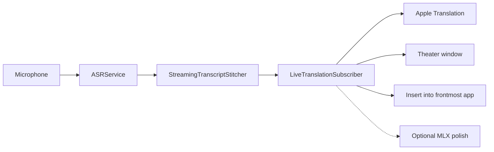

# Architecture

fluidSubtitles is a FluidVoice branch. Speech recognition and the macOS app shell come from upstream. This document is the map of **this product**: Theater captions and dictation insert among Korean, English, and Thai.

## What to work on

| Area | Path | Role |
| --- | --- | --- |
| Live translation | `Sources/FluidSubtitles/Services/LiveTranslation/` | Clause split, Apple Translation, Theater archive, latency HUD, optional MLX |
| Theater UI | `Sources/FluidSubtitles/UI/LiveTranslation/` | Home, Theater window, presenter chrome |
| Speech engine | `ASRService.swift` plus `ASRService+*.swift` | Microphone → transcript. Keep this as the engine, not the product. |
| Dictation insert | `TypingService`, `GlobalHotkeyManager` | Types the current listen into the frontmost app |
| Overlay | `BottomOverlayView`, `NotchOverlayManager` | Dictation preview only |
| Settings | `SettingsStore.swift` plus `SettingsStore+*.swift` | Persist models, shortcuts, Theater options |
| App shell | `ContentView.swift` plus `ContentView+*.swift` | Window, dictation start, insert, onboarding |

New settings belong in a `SettingsStore+*.swift` file, not in the core store. New ContentView routing belongs in `ContentView+*.swift`.

## Live path

1. `ASRService` produces partial and final transcripts from the selected Voice Engine.
2. `LiveTranslationController` owns a caption or insert session.
3. `LiveTranslationSubscriber` segments clauses, then calls `AppleTranslationEngine` when a clause commits. Cross-language commits send the last 1–2 source clauses so Korean/Thai keep a little prior context, then peel the new caption.
4. Theater shows the target language. Source can sit under each line when that setting is on.
5. Insert types only the current listen. Copy takes the whole Theater board. Insert needs Accessibility; Korean and Thai depend on the other app’s input method.

Apple Translation is on-device. Language packs download the first time a pair is used. Listen waits until the pack reports `.installed`. Theater shows a measured `mic · e2e · ASR · MT` clock. Hide from screen share uses `NSWindow.sharingType`. See [LIVE_TRANSLATION_LATENCY.md](LIVE_TRANSLATION_LATENCY.md) and [APPLE_SILICON_STREAMING.md](APPLE_SILICON_STREAMING.md).

Printed Theater lines stay. Pause and Stop may commit leftover speech; they do not rewrite a caption already on the board. Korean and Thai wait for a confirm decode before the first print. Commit MT sends up to four prior source clauses, then peels. A running local MLX runner may translate that first print; Apple Translation is the fallback. Score a real talk with `docs/STAGE_SCORE.md`.

## What this product does not include

These FluidVoice surfaces were removed from this branch. Do not add them back without a product decision:

- Command Mode, terminal agent, and command chat history
- Rewrite / Edit Mode
- File Transcription / meetings
- Local HTTP API
- PostHog / analytics export

Dictation typing, Voice Engines, custom dictionary, History, and local Stats stay.

## Identity and data

`FluidProduct` holds the display name, bundle ID, GitHub home, and legacy FluidVoice / connectingCaptions keychain and Application Support names so existing local data still loads after the rename.

## Signing and sandbox

`project.pbxproj` does not contain an Apple team ID. Set `DEVELOPMENT_TEAM` in `xcconfig/Local.xcconfig` or pass `FLUIDSUBTITLES_DEVELOPMENT_TEAM` to `./build.sh`. CI builds unsigned. `./build.sh release` writes a Developer ID zip (`dist/fluidsubtitles-{version}.zip`) and notarizes when Apple credentials are set.

The app is unsandboxed. Theater and dictation need microphone access. Insert-into-another-app needs Accessibility. Voice weights and Apple language packs stay user-downloaded. Hardened Runtime is on. Unused Xcode resource-access flags (Calendar, Camera, Contacts, Location, USB, Printing, Bluetooth) stay off. Incoming network stays off; the local HTTP API was removed.

`com.apple.security.cs.disable-library-validation` remains because `CTranscribe.framework` (the TranscribeCpp / Whisper dylib) can fail to load after Xcode flattens the XCFramework layout. `./build.sh release` restores the versioned framework layout and re-signs it with the same Developer ID. A Release build that still loads Whisper without the entitlement can drop it.

GitHub `release` jobs import a Developer ID `.p12`, notarize, run `codesign --verify --deep --strict`, `spctl --assess`, and `stapler validate`, then attach `SHA256SUMS`. Missing signing or notarization credentials fail the job instead of publishing an unsigned zip.
