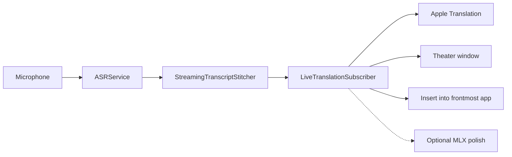

# Architecture

fluidSubtitles is a FluidVoice branch. Speech recognition and the macOS app shell come from upstream. This document is the map of **this product**: Theater captions and dictation insert among Korean, English, Thai, and Japanese.

## What to work on

| Area | Path | Role |
| --- | --- | --- |
| Live translation | `Sources/FluidSubtitles/Services/LiveTranslation/` | Clause split, Apple Translation, Theater archive, latency HUD, optional MLX. `LiveTranslationSubscriber` owns the session; `LiveTranslationCommitContext` and `LiveTranslationMT` are the commit / translate helpers; `TheaterStatus` is the status channel. |
| Theater UI | `Sources/FluidSubtitles/UI/LiveTranslation/` | Home, Theater window, presenter chrome |
| Speech engine | `ASRService.swift` plus `ASRService+*.swift` | Microphone → transcript. Keep this as the engine, not the product. |
| Dictation insert | `TypingService`, `GlobalHotkeyManager` | Types the current listen into the frontmost app |
| Overlay | `BottomOverlayView`, `NotchOverlayManager` | Dictation preview only |
| Settings | `SettingsStore.swift` plus `SettingsStore+*.swift` | Persist models, shortcuts, Theater options |
| App shell | `ContentView.swift` plus `ContentView+*.swift` | Window, dictation start, insert, onboarding |

New settings belong in a `SettingsStore+*.swift` file, not in the core store. New ContentView routing belongs in `ContentView+*.swift`.

## Live path

1. Theater Listen, Voice, Translate, and I speak / Show as run on macOS 15 and later. Apple Speech Analyzer stays macOS 26+. `ASRService` produces partial and final transcripts from the selected Voice Engine. **I speak** owns the Voice Engine listening language; leftover Whisper / Apple Speech / Cohere / Nemotron locales are pinned to that language and ASR reloads so Translate cannot start on a stale locale. **Voice Engine** sharpens speech into text. **Translation Engine** is on-device Apple Translation. **Voice** writes that transcript. **Translate** is Korean, English, Thai, and Japanese captions. Both use the microphone. A button on Home and Theater chrome switches the two. Hosted CI cannot prove a live Theater listen.
2. `LiveTranslationController` owns a caption or insert session. Critical thermal can swap this Listen to Apple Speech without writing the Voice Engine setting; the user engine returns on Stop.
3. `LiveTranslationSubscriber` segments clauses, then calls `AppleTranslationEngine` when a clause commits. The current unread clause can print while you talk. A cumulative ASR restitch peels already-printed sentences so the next line is only the new clause. Cross-language commits send the last **4** source clauses **from this Listen** so Korean/Japanese/Thai keep prior context, then peel the new caption. A clause-boundary approximation can prefetch Apple Translation (`.live`) so the commit can swap in a cached caption. Theater starts empty on launch and on each new caption Listen. A previous talk or a crash leftover is not restored.
4. Theater stacks the Show-as title above a smaller, dimmer spoken line. The current title types through commit (Flow / Word). Flow walks one letter at a time and pauses at commas and periods. Same-language Voice / English→English has no spoken undertone, so leftover peel runs on the title. A finished sentence or a natural pause starts the next title; the last title stays put. Wrap fills left to right so a printed word does not jump when the sentence grows. The live title grows as it types so a blank translation band does not pop in, and the board slides up when a new wrap line needs room. **Show the spoken line** off means translation only. Print-in is Flow, Word, Fade, or Instant. **Captions only** keeps Listen and overlays languages on hover so the board does not jump. Transparent Light uses white captions and a dark halo so text stays visible on slides. The window uses the visible display so captions can span the board; a saved 1100×440 frame is upgraded. Overflow past 200 lines is `TheaterSession.jsonl` on a serial flush queue. The window keeps a short scrollback; older lines stay in the archive.
5. Insert types only the current listen. Copy takes the whole Theater board. Clear wipes the board and the session archive. Insert needs Accessibility. A Korean, Japanese, or Thai IME (or Show-as Korean/Japanese/Thai after the first Theater caption) uses Reliable Paste instead of unicode keystrokes.

Apple Translation is on-device. Language packs download the first time a pair is used. Listen waits until the pack reports `.installed`. Theater shows a measured `mic · e2e · ASR · MT` clock. Hide from screen share uses `NSWindow.sharingType`. See [LIVE_TRANSLATION_LATENCY.md](LIVE_TRANSLATION_LATENCY.md) and [APPLE_SILICON_STREAMING.md](APPLE_SILICON_STREAMING.md).

Printed Theater lines stay put for this Listen. The board only slides up slowly when a new line needs room on a full board. A new Listen or a new app start wipes the board. The current unread clause can sit on Theater while you talk; a new sentence starts on a new line. Finished lines keep their size. The first words of a clause can print before it is ready to commit. A natural pause commits leftover speech that is a real clause. Pause and Stop do not rewrite a caption already on the board. Clear wipes the board and the session archive; Listen can keep going. Close Theater confirms if Listen is running. Undo removes only the last visible line. Korean, Japanese, and Thai print from the live stitch; a fuller decode runs on Pause and Stop leftover only. Commit MT sends up to four prior source clauses, then peels. A running local MLX runner may translate that first print; Apple Translation is the fallback. Score a real talk with `docs/STAGE_SCORE.md`.

## What this product does not include

These FluidVoice surfaces were removed from this branch. Do not add them back without a product decision:

- Command Mode, terminal agent, and command chat history
- Rewrite / Edit Mode
- File Transcription / meetings
- Local HTTP API
- PostHog / analytics export

Dictation typing, Voice Engines, custom dictionary, History, and local Stats stay.

## Identity and data

`FluidProduct` holds the display name, bundle ID, GitHub home, and legacy FluidVoice / connectingCaptions keychain and Application Support names so existing local data still loads after the rename.

## Signing and sandbox

`project.pbxproj` does not contain an Apple team ID. Set `DEVELOPMENT_TEAM` in `xcconfig/Local.xcconfig` or pass `FLUIDSUBTITLES_DEVELOPMENT_TEAM` to `./build.sh`. CI builds unsigned. `./build.sh release` writes a Developer ID zip (`dist/fluidsubtitles-{version}.zip`) and notarizes when Apple credentials are set.

The app is unsandboxed. Theater and dictation need microphone access. Insert-into-another-app needs Accessibility. Voice weights and Apple language packs stay user-downloaded. Hardened Runtime is on. Unused Xcode resource-access flags (Calendar, Camera, Contacts, Location, USB, Printing, Bluetooth) stay off. Incoming network stays off; the local HTTP API was removed.

`com.apple.security.cs.disable-library-validation` remains because `CTranscribe.framework` (the TranscribeCpp / Whisper dylib) can fail to load after Xcode flattens the XCFramework layout. `./build.sh release` restores the versioned framework layout and re-signs it with the same Developer ID. A Release build that still loads Whisper without the entitlement can drop it.

GitHub `release` jobs import a Developer ID `.p12`, notarize, run `codesign --verify --deep --strict`, `spctl --assess`, and `stapler validate`, then attach `SHA256SUMS`. Missing signing or notarization credentials fail the job instead of publishing an unsigned zip.
