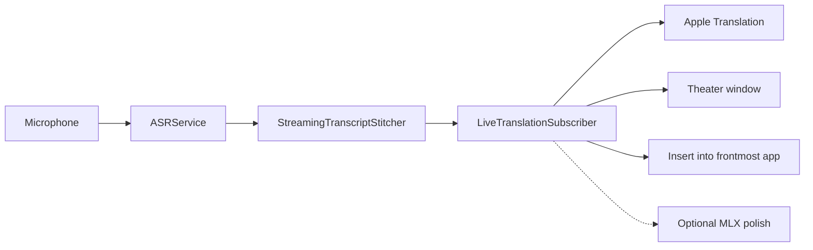

# Architecture

fluidSubtitles is a FluidVoice branch. The speech pipeline, settings, and macOS app shell come from upstream. This document describes the translation layer added on top.

## Live path

1. `ASRService` produces partial and final transcripts from the selected Voice Engine.
2. `LiveTranslationController` owns a caption or insert session.
3. `LiveTranslationSubscriber` segments clauses, then calls `AppleTranslationEngine`.
4. Theater shows the target language. Source can sit under it when that setting is on.
5. Insert types only the current listen. Copy takes the whole Theater board.

Apple Translation is on-device. Language packs are downloaded through Apple’s framework the first time a pair is used. See [LIVE_TRANSLATION_LATENCY.md](LIVE_TRANSLATION_LATENCY.md) for debounce and budget details.

## What this fork does not do

- It does not send analytics in this release.
- It does not use Fluid Intelligence on the translation path.
- Optional LM Studio / MLX polish runs on finished lines only, never on an open clause.

## Identity and data

`FluidProduct` holds the display name, bundle ID, GitHub home, and legacy FluidVoice / connectingCaptions keychain and Application Support names so existing local data still loads after the rename.

## Signing

`project.pbxproj` does not contain an Apple team ID. Set `DEVELOPMENT_TEAM` in `xcconfig/Local.xcconfig` or pass `FLUIDSUBTITLES_DEVELOPMENT_TEAM` to `./build.sh`. CI builds unsigned.
